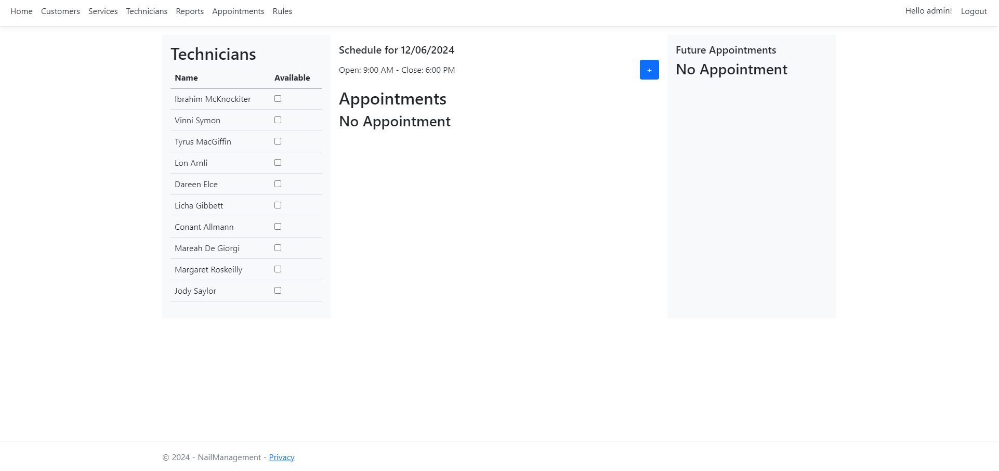

# NailSalonManagement with Entity Framework

This project is a simple nail salon management system allowing users to manage the salon's supplies, employees, and customers. 
The project is built using Entity Framework and SQL Server.

**Authors:**

[Thien Nguyen](https://github.com/bluestar7589)

[Ivan Vanwoerkom](https://github.com/ScottProgrammer88)


## Getting started

- Visual Studio 2022
- .Net 8

### Generate database from the Models

Click on Tools -> Nuget package manager -> Package manager console
Type the command below to generate the models
```csharp
Update-Database
```

You may need to change the DB connection string located in the ApplicationDbContext class.
By default, it points to mssqllocaldb. You can change it to your own database.
```csharp
optionsBuilder.UseSqlServer("Data Source=(localdb)\\MSSQLLocalDB;Initial Catalog=NailSalon");
```

### Useful websites for reference
[Introduction to Identity on ASP.NET Core](https://learn.microsoft.com/en-us/aspnet/core/security/authentication/identity?view=aspnetcore-8.0&tabs=visual-studio)
[Custom User Management in ASP.NET Core MVC with Identity](https://codewithmukesh.com/blog/user-management-in-aspnet-core-mvc/)

### Initial account information
The initial information for the admin account is:
- Admin account: admin
- Password: Admin@123

Use the information above to log in to the system and fulfill features.


Please see the following pictures below for reference:
1. Login Page
Users/admin will log in based on their role in order to use the website's features

2. Register Page
To register a new user account for a new employee

3. Dashboard Page
The dashboard page shows all basic employees, the current appointments, and future appointments

4. Customer Index
The index page for customers will be the same layout with services, technicians, appointments... etc

5. Customer Edit
The edit page for customers will be the same layout with services, technicians, appointments... etc so users/admin can adjust, or edit information when needed.

6. Report Page
This page will show the report by total amount by range (from date to date) as well as the report for services

7. Appointment
The index page for appointments


